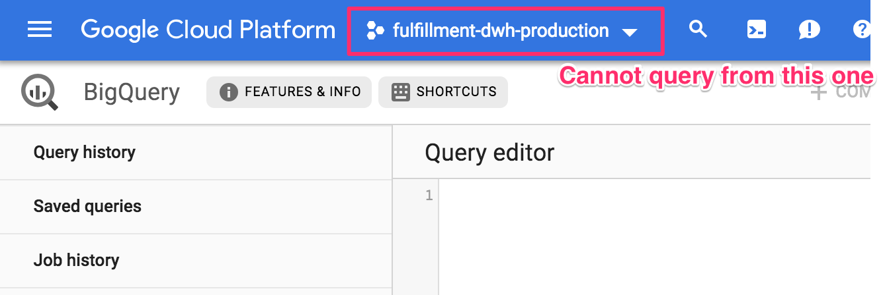
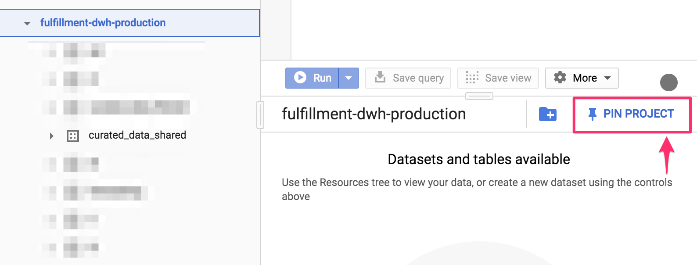

# Setting up GCP projects for running queries

The datasets are located in [`fulfillment-dwh-production`](https://console.cloud.google.com/bigquery?project=fulfillment-dwh-production). You can explore the tables and datasets in this account, but you cannot run queries. To do so, prepare your own project with a Billing account connected and query the dataset from that project. To run initial experiments, you can run BigQuery without a billing account in sandbox mode with [some limitations](https://cloud.google.com/bigquery/docs/sandbox#limits). In case you need to create a new BigQuery project, please submit a request using the following form: [Request Form](https://jira.deliveryhero.com/servicedesk/customer/portal/38/create/763).

Take care on big historical datasets, filtering on the partitioning column (e.g. if `created_date` is present, it will limit the data your query scans.

In order to see the dataset in your project, pin it first from the `fullfillment-dwh-production` project.

