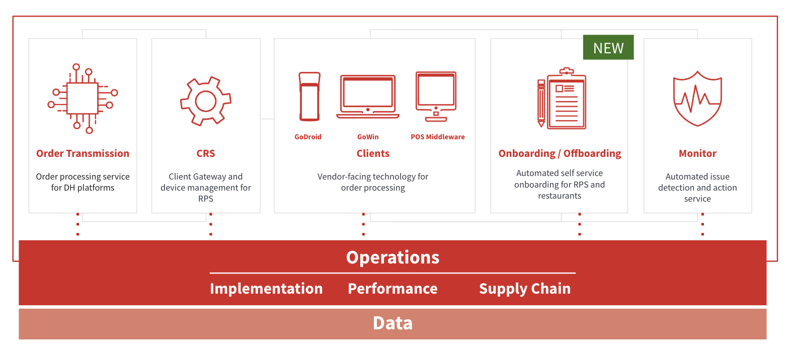
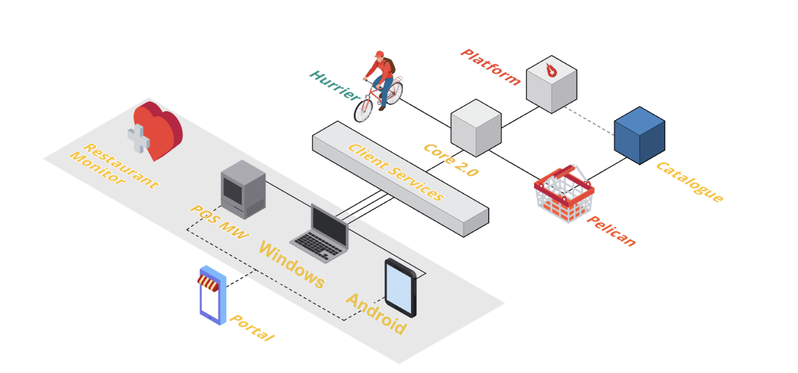

# Curated entities

Curated entities contain entites from both RPS and logisitics.
Below is an overview for both:

###Logistics

For a quick non-exhaustive overview of connections within Logistics systems, refer to the graph below. Feel free to ask us for any clarifications.

The BigQuery datasets will often nest children nodes into the parent (e.g. `deliveries` are a nested dataset of `orders`). The documentation of individual entities should clarify all relations.

###RPS
For a quick non-exhaustive overview of connections within RPS systems, refer to the graph below. Feel free to ask us for any clarifications.

Below you can see an overview of RPS teams and how the services within RPS interact with each other and external parties. A more complete relational diagram between our curated layers will follow shortly.

